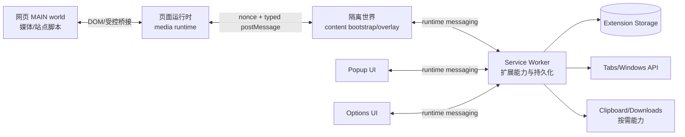

# Web Extension 目标架构

> 文档 ID：ARCH-001  
> 状态：Approved Phase 4 Baseline / Phase 6.5 UX Amendment In Review
> 负责人：Architect  
> 最后更新：2026-08-12
> 关联：REQ-001、REQ-002、REQ-UX-001/002、ADR-0001、ADR-0002、ADR-0003、ADR-0015/0016

## 1. 架构目标

目标架构不是把 Legacy 文件拆成更多文件，而是把浏览器扩展的信任边界、领域能力、页面适配和界面展示拆开，使每层都能独立替换和测试。

核心约束：

- 领域核心可以在 Node 测试环境运行，不需要 `window`、真实 DOM 或浏览器扩展 API。
- 页面运行时只负责媒体发现、页面世界交互和适配器生命周期。
- content script 负责隔离世界桥接和页面 UI，不持有扩展全局秘密或任意权限。
- service worker 是扩展级状态与能力的权威入口，但不能依赖常驻内存。
- popup/options 是应用层客户端，通过应用服务和消息协议访问状态。

## 2. 运行时上下文



### 2.1 页面 MAIN world

职责：

- 观察和标记媒体元素；维护 `MediaSession` 与 active player。
- 在页面世界执行必须接触原生对象/网站脚本的受控 Hook。
- 运行纯声明式站点适配器与通用播放器命令。
- 通过严格消息桥向隔离世界报告状态和请求能力。

禁止：

- 直接调用 `chrome.*`/`browser.*`。
- 直接读取扩展存储、剪贴板、下载、标签页或远程网络权限。
- 接受没有 nonce、协议版本或请求上下文的页面消息。
- 加载远程脚本、执行字符串代码或修改页面 CSP。

### 2.2 隔离世界 content script

职责：

- 在 `document_start` 建立一次页面会话和消息桥。
- 校验页面世界消息，转换为扩展协议请求。
- 挂载页面 overlay（Shadow DOM）并提供当前页面状态。
- 处理 popup/options 需要的页面级查询和命令转发。
- 处理 URL/SPA 生命周期、frame 信息和权限不可用状态。

禁止：

- 把任意页面 `postMessage` 转发为扩展 API 调用。
- 在 DOM 中拼接不可信 HTML。
- 将完整媒体 URL、页面文本或用户配置写入日志。

### 2.3 Service Worker

职责：

- 作为扩展消息路由和权限检查中心。
- 管理版本化配置仓储、迁移、导入/导出和跨 Tab 同步。
- 提供 tabs、downloads、clipboard、permissions 等能力的最小封装。
- 管理 popup/options 连接、扩展命令、安装/更新初始化和诊断导出。
- 维护可恢复的会话索引；关键状态必须落盘。

禁止：

- 持有页面 DOM 或媒体对象。
- 依赖 service worker 永久运行的定时器和内存单例。
- 绕过消息协议直接执行来自页面的函数/代码。

### 2.4 Popup / Options / Overlay

- Popup：短生命周期、当前 Tab 操作和状态摘要。
- Options：长表单、配置编辑、快捷键、站点规则、数据管理和诊断。
- Overlay：低延迟媒体操作和状态反馈，不承载全局配置管理。

所有 UI 只调用应用服务接口；浏览器 API 和媒体 DOM 由适配器注入。

## 3. 分层模型

```text
Presentation
  popup / options / overlay components
Application
  commands / queries / use cases / session orchestration
Domain
  media model / capabilities / settings / adapter contracts / errors
Infrastructure
  browser adapter / storage / messaging / DOM / logging / clock
Entrypoints
  background / content / page-main / popup / options
```

依赖方向只能从上向下：Presentation → Application → Domain；Infrastructure 实现 Domain 定义的 Port；Entrypoints 负责组装依赖。Domain 不得反向依赖 UI 或浏览器实现。

## 4. 推荐源码结构

```text
web-extension/
  manifest/
    base.ts
    chrome.ts
    firefox.ts
  src/
    domain/
      media/
      command/
      settings/
      adapter/
      diagnostics/
      shared/
    application/
      media/
      settings/
      commands/
      diagnostics/
    infrastructure/
      browser/
      dom/
      storage/
      messaging/
      logging/
      time/
    runtime/
      background/
      content/
      page-main/
      ports/
    ui/
      popup/
      options/
      overlay/
      components/
      i18n/
    adapters/
      generic/
      sites/
      registry.ts
    test-support/
      fixtures/
      fake-browser/
      fake-media/
      pages/
  tests/
    unit/
    component/
    integration/
    e2e/
    compatibility/
```

在迁移期间，当前 `web-extension/*.js` 文件可保留为 `legacy-bridge` 构建入口；新代码不得从新域导入它们。最终切换前再通过单独任务删除或归档桥接入口。

## 5. 核心领域模型

### 5.1 MediaSession

```ts
type MediaId = string;
type FrameId = number;

interface MediaSession {
  id: MediaId;
  frameId: FrameId;
  kind: "video" | "audio" | "custom-video";
  state: "discovered" | "ready" | "active" | "paused" | "removed" | "error";
  metrics: {
    width: number;
    height: number;
    duration: number | null;
    currentTime: number;
    volume: number;
    playbackRate: number;
    visible: boolean;
  };
  capabilities: MediaCapabilities;
  adapterId: string;
  updatedAt: number;
}
```

真实 `HTMLMediaElement` 只能存在于 page-main runtime；跨上下文只传可序列化的快照和命令结果，不传 DOM 引用、函数或异常对象。

### 5.2 Capabilities

能力必须显式声明，例如 `playbackRate`、`volume`、`seek`、`fullscreen`、`pictureInPicture`、`capture`、`downloadExperimental`。UI 根据能力渲染，禁止通过 try/catch 猜测功能是否存在。

### 5.3 Command

命令使用判别联合：

```ts
type MediaCommand =
  | { type: "media.play"; mediaId: MediaId }
  | { type: "media.pause"; mediaId: MediaId }
  | { type: "media.seek"; mediaId: MediaId; deltaSeconds: number }
  | { type: "media.set-rate"; mediaId: MediaId; value: number }
  | { type: "media.set-volume"; mediaId: MediaId; value: number }
  | {
      type: "media.toggle-fullscreen";
      mediaId: MediaId;
      mode: "native" | "web";
    };
```

命令执行返回 `Result<Success, DomainError>`，包含 `code`、用户可见消息键和可选诊断上下文。

## 6. 消息协议

所有跨上下文消息使用统一 Envelope：

```ts
interface MessageEnvelope<T extends string, P> {
  protocol: 1;
  type: T;
  requestId: string;
  source: "page-main" | "content" | "background" | "popup" | "options";
  tabId?: number;
  frameId?: number;
  sessionId?: string;
  payload: P;
}
```

规则：

1. 每个 request 有明确 response/error；异步响应有超时和取消语义。
2. 接收方按 `protocol`、`type`、来源上下文、payload Schema 和权限校验后才处理。
3. 页面桥使用每次会话随机 nonce；content script 只接受当前窗口、当前 frame 且 nonce 匹配的消息。
4. 错误响应不暴露堆栈、完整 URL、token 或媒体源。
5. 未知消息类型必须安全忽略并记录采样计数，不能抛出导致 listener 中止。
6. 协议变更采用向后兼容字段策略；破坏性变化提升协议主版本并保留过渡期。

## 7. 状态所有权

| 状态                  | 权威位置                        | 可观察者            | 持久化           |
| --------------------- | ------------------------------- | ------------------- | ---------------- |
| 当前媒体 DOM/原生属性 | page-main                       | content/overlay     | 否               |
| 当前 frame 的媒体快照 | content/page-main session store | popup/options       | 短期内存，可重建 |
| 全局设置              | background settings repository  | 所有上下文          | 是               |
| 站点覆盖设置          | background settings repository  | 当前站点上下文      | 是               |
| 快捷键注册表          | background/application          | UI、page-main       | 是               |
| 诊断 ring buffer      | 各 runtime 本地                 | 用户导出            | 可选、限量       |
| 安装/迁移版本         | background metadata             | release/diagnostics | 是               |
| 播放进度              | background SettingsRepository   | content runtime     | 可选、TTL/容量   |
| visual/presentation   | page-main MediaController       | content/overlay     | 否               |
| 截图 Artifact         | 当前 command response           | isolated content    | 否               |
| 跨 Tab advisory event | background event service        | 其他 Tab content    | 否               |

禁止同一配置同时由 `localStorage`、页面变量和扩展 storage 无规则竞争写入。迁移期旧桥接数据只能通过显式导入或一次性转换进入新仓储。

## 8. 生命周期

1. `document_start`：content 建立 session nonce，准备桥接和权限状态。
2. page-main 初始化：注册 discovery、adapter registry 和 command executor。
3. 发现媒体：创建 `MediaSession`，发送 snapshot；只为 active/需要观察的媒体安装高成本监听器。
4. SPA 导航：更新页面上下文，清理失效适配器和媒体实例，保留全局设置。
5. frame 卸载：发送 dispose 或由超时回收 session；不遗留 listener/observer。
6. service worker 重启：从 storage 恢复配置和元数据，等待页面重新握手，不假设旧端口仍有效。
7. 扩展更新：先备份数据，再执行迁移；失败时恢复备份并显示可恢复错误。

## 9. 浏览器能力端口

定义最小 Port 接口，由 Chromium/Firefox 实现：

- `BrowserStoragePort`
- `RuntimeMessagingPort`
- `TabsPort`
- `PermissionsPort`
- `ClipboardPort`
- `DownloadsPort`（实验）
- `ExtensionResourcePort`
- `LoggerPort`
- `ClockPort`

Domain/Application 只依赖这些接口。所有 Port 方法都返回 Promise 或 `Result`，禁止把 callback 风格 API 渗透到业务层。

## 10. 错误隔离

错误按层处理：

- Domain：返回可判定错误，不写日志。
- Application：添加 use-case 与 request ID 上下文。
- Infrastructure：转换浏览器异常、权限错误和序列化错误。
- Entrypoint：捕获边界异常，保证其他 listener/模块继续运行。
- UI：把错误码映射为本地化、可行动提示。

## 11. 构建与包形态

推荐采用 WXT（Vite-based）+ TypeScript 的多入口构建，manifest 由 profile 生成；若 Phase 0 spike 不满足隔离或浏览器要求，则保留同样的产物契约改用 raw Vite：

- `chrome-dev`、`chrome-beta`、`chrome-prod`
- `firefox-dev`、`firefox-beta`、`firefox-prod`

每个 profile 固定浏览器 API polyfill、权限、CSP、资源和 source map 策略。构建应输出 manifest、完整扩展目录、zip、校验和、依赖许可证报告及 SBOM。具体工具可在 Phase 0 spike 中验证，但不得牺牲上述产物契约。

## 12. Phase 4 已执行架构

- page-main generic controller 持有 DOM、visual/presentation 状态与 Canvas capture；跨上下文只传 typed snapshot/result。
- isolated content 在 top frame 创建 closed ShadowRoot Overlay；iframe 只运行 runtime。跨 frame 媒体聚合尚未实现。
- background 继续作为 progress 持久化权威，并作为 cross-tab advisory event 的校验/转发路由；advisory event 本身不是
  权威状态，service worker 内存也不是状态事实源。
- 截图下载使用 content DOM 的 Blob/anchor，不申请 `downloads`；媒体下载仍为 Phase 7 实验能力。
- bundle budget 在 build 后同时检查 background/content/page-main raw size，以及 required host、static content script、WAR 回退。

相关决策：ADR-0009～ADR-0012、ADR-0015（Phase 6.5 提案）。Preview 架构允许进入 Phase 5，但 capture 消息体、iframe 聚合、跨 Tab 仲裁和
Overlay z-index 仍需在 Beta 前独立收敛。

## 13. Phase 6.5 UX 架构复核（In Review）

用户实测已证明 Phase 4 的 `document.documentElement` fixed Overlay 只满足技术 Preview，不满足交付级页面体验。
Phase 6.5 目标由 [媒体 UI、反馈与倍速策略运行时架构](./ux-runtime-and-policy-architecture.md) 和
[ADR-0015](./adr/ADR-0015-media-anchored-overlay-and-feedback.md) 与
[ADR-0016](./adr/ADR-0016-playback-intent-policy-and-lifecycle.md) 定义：保留 closed ShadowRoot、typed bridge 和无 WAR
边界，把视觉归属改为 per-media anchor，并把 playback intent/policy/lifecycle 与媒体实际状态分离。该修正仍处于用户审核阶段，
不表示已经实施或批准。
